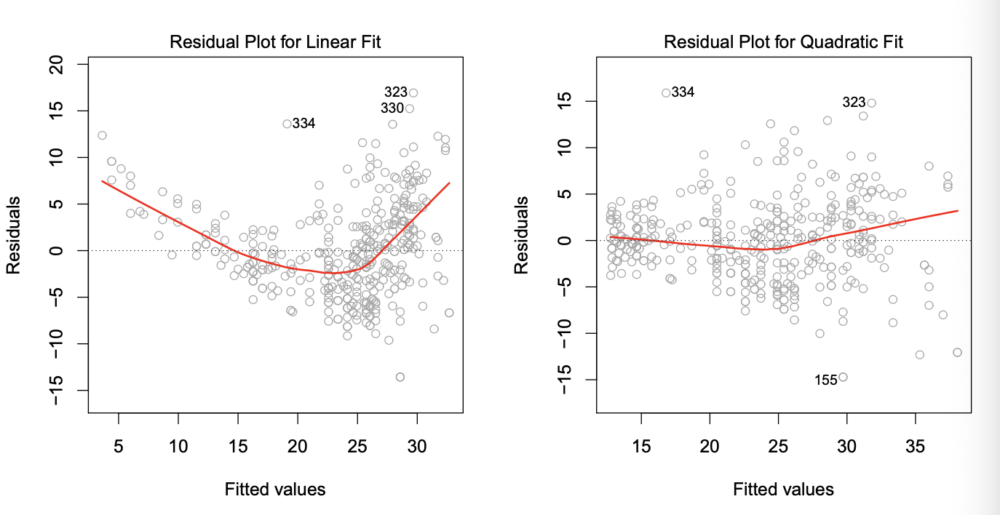
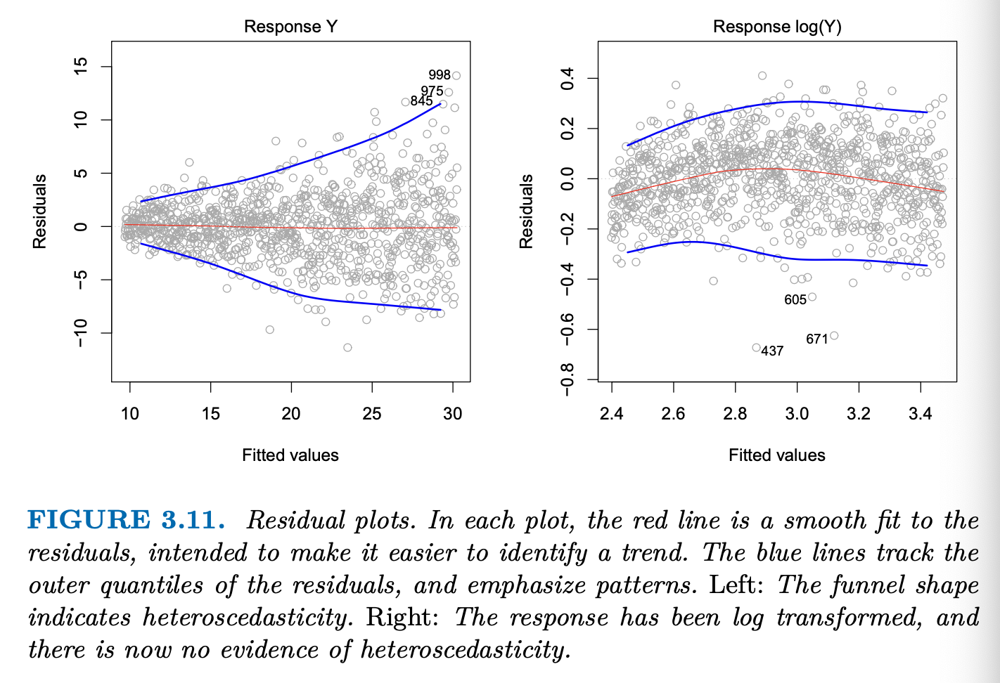

# Simple Linear Regression
$$Y\approx\beta_0+\beta_1X$$
$\approx$: is approximately modeled as  
$Y$: quantitiative response  
$X$: predictor variable  

$$\hat y = \hat\beta_0+\hat\beta_1x$$
$\beta_0$, $\beta_1$: model coefficients/parameters  
$\beta_0$: intercept  
$\beta_1$: slope  
## Estimating the Coefficients
$(x_1,y_1), (x_2,y_2), \dots, (x_n,y_n)$: $n$ observation pairs, which consists of a measurement of $X$ and a measurement of $Y$  
$\hat y_i= \hat\beta_0+\hat\beta_1x_i$: the *least square line*, the prediction for $Y$ based on the $i$th value of $x$  
$e_i = y_i - \hat y_i$: the $i$th residual (observed_value - predicted_response_value)  
*residual sum of squares* $\text{RSS} = e_1^2+e_2^2+\cdots+e_n^2$  
*least square approach*: used to choose $\hat\beta_0$ and $\hat\beta_1$ to minimize the $\text{RSS}$
$\hat\beta_1=\frac{\sum_{i=1}^n(x_i-\bar x)(y_1-\bar y)}{\sum_{i=1}^nx_i-\bar x}$  
$\hat\beta_0=\bar y-\hat\beta_1\bar x$  
$\bar y\equiv\frac{1}{n}\sum_{i=1}^ny_i$  (sample means)  
$\bar x\equiv\frac{1}{n}\sum_{i=1}^nx_i$  (sample means)  
## Assessing the Accuracy of the Coefficient Estimates
*true* relationship between $X$ and $Y$: $Y=\beta_0 +\beta_1X + \epsilon$ (the *population regression line*, best linear approximation to the true relationship between $X$ and $Y$)  
$\mu$: the population mean of a random variable $Y$  
Unbiased estimator, unbiasedness: The average of $\hat\beta_0$ and $\hat\beta_1$ gained from large number of data sets will be equal to $\beta_0$ and $\beta_1$; But a single estimate may be a substantial underestimate or overestimate.  

How far will $\hat\mu$ be from real?  
-> Standard error of $\hat\mu$, tells about the average amount $\hat\mu$ differs from the actual value of $\mu$: $\text{Var}(\hat\mu)=\text{SE}(\hat\mu)^2=\frac{\sigma^2}{n}$  
    $\sigma$: the standard deviation of each of the realization $y_i$ of $Y$  

How close $\hat\beta_0$ and $\hat\beta_1$ to the real value?  
$\text{SE}(\hat\beta_0)^2=\sigma^2[\frac{1}{n}=\frac{{\bar x}^2}{\sum_{i=1}^n}(x_i-\bar x)^2]$  
$\text{SE}(\hat\beta_1)^2=\frac{\sigma^2}{\sum_{i=1}^n(x_1-\bar x)^2}$  
    $\sigma^2=\text{Var}(\epsilon)$  
    Assumption: errors $\epsilon_i$ for each observation have common variance $\sigma^2$ and are uncorrelated.  

In general, $\sigma^2$ is not known, but can be estimated. -> *residual standard error* $\text{RSE}=\sqrt{\frac{\text{RSS}}{n-2}}$  

**Confidence Interval**: a range of values such that with 95% probability, the range will contain the true unknown value of the parameter.  
$\beta_1$: $\hat\beta_1 \pm2\cdot\text{SE}(\beta_1)$ or $[\hat\beta_1-2\cdot\text{SE}(\hat\beta_1),\hat\beta_1+2\cdot\text{SE}(\hat\beta_1)]$  
$\beta_0$: $\hat\beta_0\pm2\cdot\text{SE}(\beta_0)$ or ...  

**Hypothesis Test**:  
$H_0$: There is no relationship between $X$ and $Y$. (*null hypothesis*)  
$H_\alpha$: There is some relationship between $X$ and $Y$. (*alternative hypothesis*)  
$H_0$: $\beta_1=0$  
$H_\alpha$: $\beta_1\ne0$  

*$t$-statistic*: $t=\frac{\hat\beta-\beta_0}{\text{SE}(\hat\beta)}=\frac{\hat\beta_1-0}{\text{SE}(\hat\beta_1)}$  
*$p$-value* (probability of observing any number $\ge |t|$ in absolute value, assuming $\beta_1=0$): small $p$-value indicates association between predictor and response, when $p$-value is small enough($<0.05$), reject the null hypothesis in favour of the alternative hypothesis.
## Assessing the Accuracy of the Model
### Residual Standard Error
$\text{RSE}$: an estimate of the standard deviation of $\epsilon$, the average amount that the response will diviate from the true regression line (due to random error terms).  --should be small, close to 0.
$$\text{RSE}=\sqrt{\frac{1}{n-2}\text{RSS}}=\sqrt{\frac{1}{n-1}\sum_{i=1}^n(y_i-\hat y_i)^2}$$
### $R^2$ Statistic
$$R^2=\frac{\text{TSS}-\text{RSS}}{\text{TSS}}=1-\frac{\text{RSS}}{\text{TSS}}$$
*total sum of squares* $\text{TSS}=\sum(y_i-\bar y)^2$  
*residual sum of squares* $\text{RSS}=\sum_{i=1}^n(y_i-\hat y_i)^2$, measures the amount of variability that is **left unexplained** after performing the regression.  
$\text{TSS}-\text{RSS}$ measures the amount of variability that is **explained** by performing the regression.  
$R^2$ measures the *proportion* of variability in $Y$ that can be explained using $X$. -- should be large, close to 1.  
In simple linear regression setting, $R^2=r^2$, while $r=\text{Cor}(X,Y)=\frac{\sum_{i=1}^n(x_i-\bar x)(y_i-\bar y)}{\sqrt{\sum_{i=1}^n(x_i-\bar x)^2}\sqrt{\sum_{i=1}^n(y_i-\bar y)^2}}$
# Multiple Linear Regression
$$Y=\beta_0+\beta_1X_1+\beta_2X_2+\cdots+\beta_pX_p+\epsilon$$
## Estimating the Regression Coefficients
$$\hat y=\hat\beta_1x_1+\hat\beta_2x_2+\cdots+\hat\beta_px_p$$
Use least squares approach to minimize the sum of squared residuals.  
$\text{RSS}=\sum_{i=1}^n(y_i-\hat y_i)^2=\sum_{i=1}^n(y_i-\hat\beta_0-\hat\beta_1x_{i1}-\hat\beta_2x_{i2}-\cdots-\hat\beta_p x_{ip})^2$
## Some Important Questions
### Relationship Between the Response and Predictors
$H_0$: $\beta_1=\beta_2=\cdots=\beta_p=0$  
$H_1$: at least one $\beta_j$ is non-zero  

$F$-Statistic: $F=\frac{(\text{TSS-\text{RSS}})/p}{\text{RSS}/(n-p-1)}$  
$\text{TSS}=\sum(y_i-\bar y)^2$  
$\text{RSS}=\sum(y_i-\hat y_i)^2$  

If the linear model assumptions are correct, then $E[\text{RSS}/(n-p-1)]=\sigma^2$.
If $H_0$ is true, then $E[(\text{TSS}-\text{RSS})/p]=\sigma^2$

If there is no relationhship between response and predictors, we would expect $F$-statistic to be close to 1.  
If $H_\alpha$ is true, then $E[(\text{TSS}-\text{RSS})/p]>\sigma^2$, so we expect $F>1$.
### Deciding on Important Variables
Often the response is only associated with a subset of the predictors, the goal is to fit a single model involving only thsoe predictors -- *variable selection, Chapter 6, (Mallow's $C_p$, Akaike information criterion AIC, Bayesian information criterion BIC, and adjusted $R^2$)*  
Three classical approaches:  
1. *Forward selection*: Begin with the *null* model, which contains an intercept but no predictors. Then fit $p$ simple linear regressions and add to the null  model the variables that results in the lowest $\text{RSS}$ to get a two-variable model. Continue untill some stopping rule is satisfied.  [**can always be used**]
2. *Backward selection*: Start with all variables in the model, remove the variable with the largest $p$-value (lest statistically significant). Then we get a $(n-1)$-variable model. Continue untill some stopping rule is satisfied (ex. all remaining $p$-values are below some threshold)  [**cannot be used if $p>n$**]
3. *Mixed selectioin*: Combination of forward and backward selection. Start with adding variables one-by-one. If at any point the $p$-value for one of the variables in the model rises above a certain threshold, remove it. Continue untill all variables in the model have a sufficiently low $p$-value, and all variables outside the model would have a large $p$-value if added to the model.
### Model Fit
1. A fitted linear model maximizes the correlation among all possible linear models. The correlation: $R^2=\text{Cor}(Y,\hat Y)^2$  
2. An $R^2$ value close to 1 indicates that the model explains a large portion of the variance in the response variable.  
3. $R^2$ will always increase when more variable are added to the model, even if those variables are only weakly associated with the response.  
4. $\text{RSE}=\sqrt{\frac{1}{n-p-1}\text{RSS}}$  
### Predictions
Three sorts of uncertainty:  
1. The coefficient estimates $\hat\beta_0, \hat\beta_1, \dots, \hat\beta_p$ are estimates for $\beta_0, \beta_1, \dots, \beta_p$, which is the *least squares plane $\hat Y=\hat\beta_0+\hat\beta_1X_1+\cdots+\hat\beta_pX_p$ is only an estimate for the true population regression plane $f(X)=\beta_0+\beta_1X_1+\cdots+\beta_pX_p$.  
The inaccuracy in the coefficient estimates is related to the *reducible error*. We can compute a confidence interval to determine how close $\hat Y$ will be to $f(X)$.  
2. We are assuming the linear model is correct when there is additional soruce of potentially reducible error which we call *model bias*.  
3. Even if we know the true $f(X)$, we still can not predict accurately due to random error (*irreducible error*) $\epsilon$. Instead of predicting a specific value, we use *prediction intervals* to solve the problem. Prediction intervals are always wider than confidence intervals.  
# Other Considerations in the Regression Model
## Qualitative Predictors (*factors*)
### Predictors with Only Two Levels
*dummy variable*: takes on two possible numerical values (In Machine Learning, this is called "one-hot encoding")  
$$x_i=
\begin{cases}
    1 &\text{if A} \\
    0 &\text{if not A}
\end{cases}$$

$$y_i=\beta_0+\beta_1x_i+\epsilon_i=
\begin{cases}
    \beta_0+\beta_1+\epsilon_i &\text{if A} \\
    \beta_0+\epsilon_i &\text{if not A}
\end{cases}$$

or  

$$x_i=
\begin{cases}
    1 &\text{if A} \\
    -1 &\text{if not A}
\end{cases}$$

$$y_i=\beta_0+\beta_1x_i+\epsilon_i=
\begin{cases}
    \beta_0+\beta_1+\epsilon_i &\text{if A} \\
    \beta_0-\beta_1+\epsilon_i &\text{if not A}
\end{cases}$$

The final predictions for the response will be identical regardless of the coding scheme used. The only difference is in the way that the coefficients are interpreted.
### Qualitative Predictors with More than Two Levels
EX. three attributes/status  
$$x_{i1}=
\begin{cases}
    1 &\text{if A} \\
    0 &\text{if not A}
\end{cases}$$
  
$$x_{i2}=
\begin{cases}
    1 &\text{if B} \\
    0 &\text{if not B}
\end{cases}$$

$$y_i=\beta_0+\beta_1x_{i1}+\beta_2x_{i2}+\epsilon_i=
\begin{cases}
    \beta_0+\beta_1+\epsilon_i &\text{if A} \\
    \beta_0+\beta_2+\epsilon_i &\text{if B} \\
    \beta_0+\epsilon_i &\text{if C}
\end{cases}$$

There will always be one fewer dummy variable than the number of levels. Here we call the level with no dummy variable (A) the *baseline*. We use dummy variables to incorporate both quantitative and qualitative predictors.
## Extensions of the Linear Model
The stardard linear regression model made several highly restrictive assumptions(additive & linear) that are often violated in practice.
### Additive Assumption
Additive assumption: the effect of increasing on unit on one predictor on response variable is independent of the amount spent on the other predictors.  
This is often not correct because the increase in one predictor may have effect on other predictors, this is called <u>*interaction*</u> effect.  
For example: $Y=\beta_0+\beta_1X_1+\beta_2X-2+\epsilon$  
The model says that regardless of $X_2$, a one-unit increase in $X_1$ is associated with a $\beta_1$-unit increase in Y.  
To extend this model, we add an *interaction term* $X_1X_2$,  
$Y=\beta_0+\beta_1X_1+\beta_2X-2+\beta_3X_1X_2+\epsilon$  
$=\beta_0+(\beta_1+\beta_3X_2)X_1+\beta_2X_2+\epsilon$  
$=\beta_0 +\tilde \beta_1X_1+\beta_2X_2+\epsilon$  
$(\tilde\beta_1=\beta_1+\beta_3X_2)$  
We can interprete $\beta_3$ as the increase in the effectiveness of $X_1$ associated with a one-unit increase in $X_2$ (or vice versa)

Sometimes the interaction term($X_1X_2$) has very small $p$-value, but the associated main effects($X_1,X_2$) do not. The *hierachical principle* states that *if we include an interaction in a model, we should also include the main effects, even if the $p$-value associated with their coefficients are not significant$.
### Non-linear Relationships
Sometimes the true relationship between the response and predictors are non-linear. We use *polynomial regression* to accommodate non-linear relationships.  

For example, when the data set seems to have a quadratic shape, then the model of form $Y=\beta_0+\beta_1X_1+\beta_2X_1^2+\epsilon$ might provide a better fit than $Y=\beta_0+\beta_1X_1+\epsilon$.  
Here the model is using a non-linear funtion $X_2=X_1^2$, but it's still a linear model.
## Potential Problems
Many problems may occur when fitting a linear regression model to a particular data set.
### 1. Non-linearity of the Data
Assumption: data is linear
*Residual plots* are a useful graphic tool for identifying non-linearity. We plot the residuals $e_i=y_i-\hat y_i$ versus the predictor $x_i$.  
EX.:  

A strong pattern in the residuals indicates non-linearity in the data.  

In the case of multiple regression model, we plot the residuals versus the predicted (*or fitted*) values $\hat y_i$. The residual plot should show now discernible pattern, otherwise there might be something wrong with the model.

If the residual plot indicates that there are non-linear associations in the data, a simple approach is to use non-linear trasnformations of the predictors ($\log X, \sqrt X, \text{and} X^2$). More approaches are discussed later in the book.
### 2. Correlation of Error Terms
Assumption: error terms $e_1, e_2, e_3\dots e_n$ are uncorrelated. 

In fact there is correlation among the error terms (frequently occur in *time series data*, which consists of observations for which measurements are obtained at discrete points in time), then the estimated standard errors will tend to underestimate the true standard errors. As a result, confidence and prediction intervals will be narrower than they should be.
### 3. Non-consitant Variance of Error Terms
Assumption: error terms have a constant variance, $Var(\epsilon_i)=\sigma^2$.  
The standard error, confidence intervals, and hypothesis tests associated with the linear model rely upon this assumption.

Possible solution: transform the respone $Y$ using a concave function such as $\log Y$ (right pic) or $\sqrt Y$, which leads to shrinkage of the larger responses, leading to a reduction in heteroscedasticity.

### 4. Outliers
An outlier is a point for which $y_i$ is far from the value predicted by the model.  

Typically an outlier has little effect on the least squares fit. But it can cause other problems, for example, wrong $\text{RSE}$ or confidence intervals or $p$-values or $R^2$.

In practice, it can be difficult to decide how large a residual needs to be before we consider the point to be an outlier. We can use *studentized residuals* (devide each residual $e_i$ by its estimated standard error) to address this problem. Observations whose studentized residuals are greater than 3 in absolute value are possible outliers. 
### 5. High Leverage Points
Observations with unusual $y_i$ is usually an outlier. Observations with unusual $x_i$ usually have *high leverage*.

High leverage observations tend to have a sizable impact on the estimated regression line. 

We compute the *leverage statistic* to quantify an observation's leverage, for a simple linear regression,
$$h_i=\frac{1}{n}+\frac{(x_i=\bar x)^2}{\sum_{i'=1}^n(x_{i'}-\bar x)^2}$$
The leverage statistic $h_i$ is always between $\frac{1}{n}$ and $1$, and the average leverage for all the observations is always equal to $(p+1)/n$. So if a given observation has a leverage statistic that greatly exceeds $(p+1)/n$, then we may suspect that the corresponding point has high leverage.
### 6. Collinearity
*Collinearity* refers to the situation in which two or more predictor variables are closely related to one another.

Collinearity reduces the accuracy of the estimates of the regression coefficients, which causes the standard error for $\hat\beta_j$ to grow, which results in a decline in teh $t$-statistic. As a result, we may fail to reject $H_0:\beta_j=0$.

- [ ] To-do: ways to deal with collinearity.
# Comparison of Linear Regression with $K$-Nearest Neighbors
*$K$-nearest neighbors regression (KNN regression)*  
Given a value for $K$ and a prediction point $x_0$, KNN regression first identifies the $K$ training observations that are closest to $x_0$, represented by $N_0$. It then estimates $f(x_0)$ using the average of all the training responses in $N_0$.
$$\hat f(x_0)=\frac{1}{K}\sum_{x_i\in N_0}y_i$$

The parametric approach (like linear regression) will outperform the non-parametric apprach (like KNN regression) if the parametric approach form that has been selected is close to the true form of $f$.