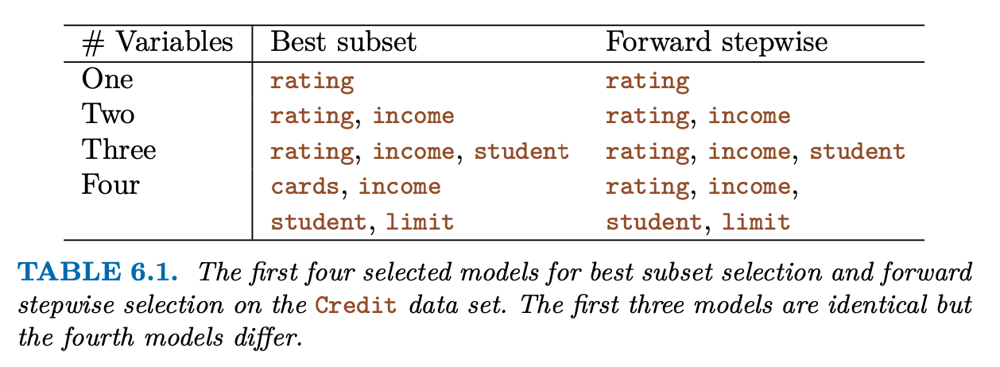

Standard linear model:
$$Y=\beta_0+\beta_1X_1+\cdots+\beta_pX_p+\epsilon$$

Some other fitting procedure instead of least squares can produce better *prediction accuracy* and *model interpretability*.  

*Prediction Accuracy*: Provided that the true relationship is approximately linear, the least square estimates will have low bias. If $n>>p$ (if $n$ is much larger than $p$), then the least square estimates tend to also have low variance. But if $n$ is not much larger than $p$, then there are a lot of variability in the least square fit.

# Subset Selection
-- Selecting subsets of predictors  
## Best Subset Selection
To perform *best subset selection*, we fit a separate least squares regression for each possible combination of the $p$(total of $2^p$) predictors, then identify the best one.  

**Algorithm: Best subset selection**
1. Let $M_0$ denote the *null model*, which contains no predictors. This model predicts the sample mean for each observation.  
2. For $k=1,2,\dots,p$:
    (a) Fit all $\begin{pmatrix} p \\ k \end{pmatrix}$ models that contain exactly $k$ predictors.
    (b) Pick the best among these modelcs, call it $M_k$. Here *best* is defined as having the smallest $\text{RSS}$, or equivalent largest $R^2$.
3. Select a single best model among $M_0,\dots,M_p$ using the prediction error on a validation set, $C_p (AIC), BIC$, or adjusted $R^2$. Or use the cross-validation method. (not using the lowest training error, because we want low test error, and low training error doesn't guarantee low test error, see Chapter 2)

Best subset selection becomes computational infeasible for values of $p$ greater than around 40 as the $2^p$ grows exponentially, exceeding the computational limitations.
## Stepwise Selection
Subset selection cannot be applied with very large $p$. And it can also potentially cause overfitting and high variance of the coefficient estimates. Thus we have *stepwise* methods
### Forward stepwise selection
1. Let $M_0$ denote the null model, which contains no predictors.
2. For $k=0,\dots,p-1$:
    (a) Consider all $p-k$ models that augment the predictors in $M_k$ with one additional predictor.
    (b) Choose the best among these $p-k$ models, and call it $M_{k+1}$. Here best is defined as having smallest $\text{RSS}$ or highest $R^2$.
3. Select a single best from among among $M_0,\dots,M_p$ using the prediction error on a validation set, $C_p (AIC), BIC$, or adjusted $R^2$. Or use the cross-validation method.

Forward stepwise selection consideres a much smaller set of models compared to the subset selection method. It starts with a model contains no predictors, then adds predictors to the model one-at-a-time.

Forward stepwise selection involves a total of $1+\sum_{k=0}^{p-1}(p-k)=1+p(p+1)/2$ models, much less than $2^p$.

Though forward stepwise selection tends to do well in practice, it is not guaranteed to find the best possible model out of all $2^p$ models.

Forward stepwise selection can be applied even in the high-dimentional setting where $n<p$; however, in this case, it is possible to construct submodels $M_0,\dots,M_{n-1}$ only, since each submodel is fit using least squares, which will not yield a unique solution if $p \ge n$.
### Backward Stepwise Selection
1. Let $M_p$ denote the full model, which contains all $p$ predictors.
2. For $k=p,p-1,\dots,1$:
    (a) Consider all $k$ models that contain all but one of the predictors in $M_k$, for a total of $k-1$ predictors.
    (b) Choose the best among these $k$ models, and call it $M_{k-1}$. Here best is defined as having smallest $\text{RSS}$ or highest $R^2$.
3. Select a single best model from among $M_0,\dots,M_p$ using the predictiion error on a validation set, $C_p (AIC), BIC$, or adjusted $R^2$. Or use the cross-validation method.

Backward stepwise selection is also not guaranteed to yield the best model containing a subset of the $p$ predictors. 

Backward selection requires that the number of samples $n$ is larger than the number of variables $p$ (so that the full model can be fit). In contrast, forward stepwise can be used even when $n<p$, and so is the only viable subset method when $p$ is very large.

### Hybrid Approaches
variables are added and removed sequentially. This method attempts to closely mimic best subset selection while retaining the computational advantages of forward and backward stepwise selection.
## Choosing the Optimal Model
In order to select the best model with respect to test error, we need to estimate the test error.  
Two common approaches:  
1. Indirectly estimate test error by making adjustment to the training error to account for the bias due to overfitting.
2. Directly estimate the test error, using either a validation set approach or a cross-validation approach, as discussed in Chapter 5.
### $C_p, AIC, BIC$ and Adjusted $R^2$
**$C_p$**

For a fitted least squares model containing $d$ predictors,  
$$C_p=\frac{1}{n}(\text{RSS}+2d\hat\sigma^2)$$
$\sigma^2$: an estimate of the variance of the error $\epsilon$ assiciated with each responce measurement.

If $\hat\sigma^2$ is an unbiased estimate of $\sigma^2$, then $C_p$ is an unbiased estimate of test $\text{MSE}$. As a consequence, the $C_p$ statistic tends to take on a small value for models with a low test error, so when determining which of a set of models is best, we choose the model with the lowest $C_p$.

**AIC**

The AIC Criterion is defined for a large class of models fit by maximum likelihood.
$$\text{AIC}=\frac{1}{n}(\text{RSS}+2d\hat\sigma^2)$$
For least squares models, $C_p$ and $\text{AIC}$ are proportional to each other.

**BIC**
For least squares model with $d$ predictors,
$$\text{BIC}=\frac{1}{n}(\text{RSS}+\log(n)d\hat\sigma^2)$$
BIC will tend to take on a small value for a model with a low test error, so we select the model tha thas the lowest BIC value. Due to the log function, BIC generally places a heavier penalty on models with many variables, and hence results in selecting smaller models than $C_p$

**Adjusted $R^2$**
For a least squares model with $d$ variables,
$$\text{Adjusted} R^2=1-\frac{\text{RSS}/(n-d-1)}{\text{TSS}/(n-1)}$$

A large value of adjusted $R^2$ indicates a model with a low test error. Maximizing the adjusted $R^2$ is equivalent to minimizing $\frac{RSS}{n-d-1}$.

### Validation and Cross-Validation
